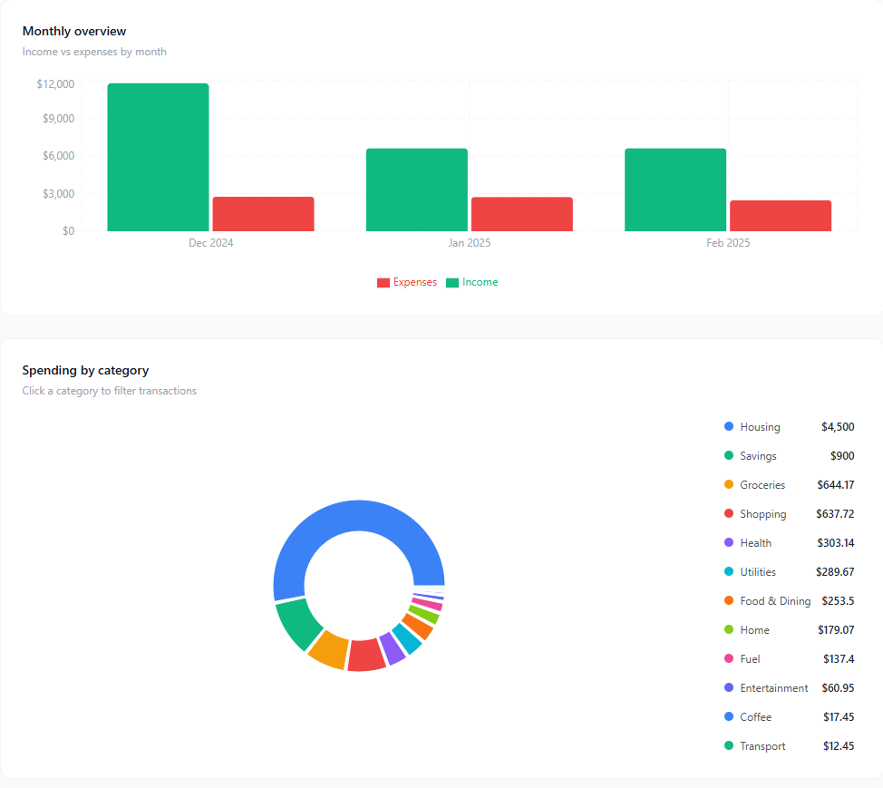

# Finance Intelligence Dashboard

A privacy-first personal finance dashboard powered by AI. Upload your bank CSV and get instant spending insights, AI categorization, anomaly detection, and saving opportunities — all running locally in your browser. Your data never leaves your machine.



## Features

- **CSV Import** — Drag and drop any bank statement CSV. No account linking, no bank APIs, no privacy risk
- **AI Categorization** — Claude automatically categorizes every transaction into smart spending categories
- **Spending Charts** — Interactive donut chart by category and monthly income vs expenses bar chart
- **Click to Filter** — Click any chart category to instantly filter the transaction table
- **AI Insights Report** — Anomaly detection and ranked saving opportunities with real dollar amounts
- **Transaction Explorer** — Search, sort, and filter by type, date range, and keyword
- **localStorage Persistence** — Your data survives page refreshes without re-uploading
- **100% Local** — No backend, no database, no server. Runs entirely in your browser

## Tech Stack

| Layer | Technology | Why |
|---|---|---|
| UI Framework | React 18 + Vite | Fast development, component-based architecture |
| Styling | Tailwind CSS v3 | Utility-first, no context switching |
| Charts | Recharts | React-native charting built on D3 |
| CSV Parsing | PapaParse | Most robust browser-based CSV parser |
| AI Engine | Anthropic Claude API | Natural language transaction categorization and insights |
| Storage | localStorage | Client-side persistence, zero backend needed |
| Version Control | Git + GitHub | Industry standard |

## Getting Started

### Prerequisites

- Node.js 18+
- An Anthropic API key from [console.anthropic.com](https://console.anthropic.com)

### Installation

1. Clone the repository
```bash
   git clone https://github.com/YOUR_USERNAME/finance-dashboard.git
   cd finance-dashboard
```

2. Install dependencies
```bash
   npm install
```

3. Create a `.env` file in the root directory
VITE_ANTHROPIC_API_KEY=sk-ant-your-key-here

4. Start the development server
```bash
   npm run dev
```

5. Open [http://localhost:5173](http://localhost:5173) in your browser

### Usage

1. Export your bank statement as a CSV file
2. Drag and drop it onto the upload area
3. Claude automatically categorizes all transactions
4. Explore your spending with interactive charts
5. Click **Generate Report** for AI-powered saving opportunities

## CSV Format

<!-- Your CSV should have these columns (exact names, lowercase):
date,description,category,amount,balance
2025-01-01,Opening Balance,Starting Balance,5000.00,5000.00
2025-01-02,Starbucks,Coffee,-5.75,4994.25 -->

## Project Structure

```
finance-dashboard/
├── src/
│   ├── components/
│   │   ├── CSVUploader.jsx      # Drag and drop CSV upload
│   │   ├── TransactionTable.jsx # Filterable transaction explorer
│   │   ├── Charts.jsx           # Donut and bar charts
│   │   └── AIInsights.jsx       # AI savings report
│   ├── utils/
│   │   └── claudeApi.js         # Anthropic API integration
│   ├── App.jsx                  # Root component and state
│   └── index.css                # Tailwind base styles
├── .env                         # API key (never committed)
├── .gitignore
└── README.md
```

## Security

- API key is stored in `.env` and excluded from version control via `.gitignore`
- All financial data is processed client-side and stored in localStorage only
- No data is sent to any server except Claude API calls for categorization and insights

## License

MIT — free to use, modify, and distribute